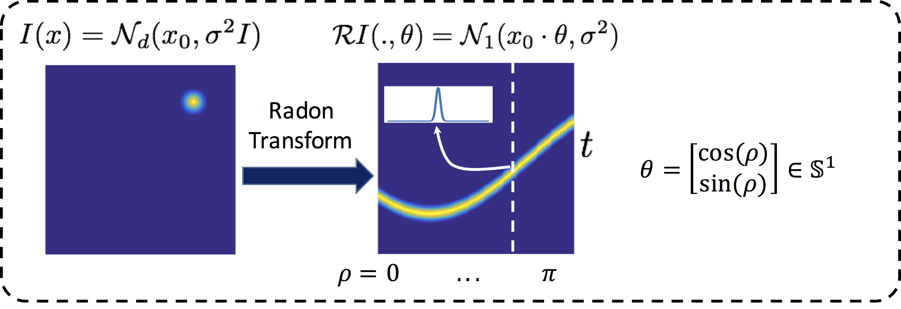
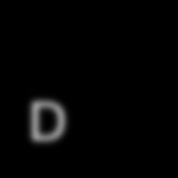
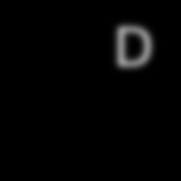
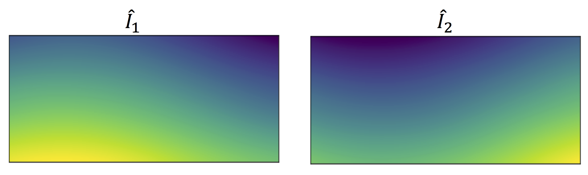
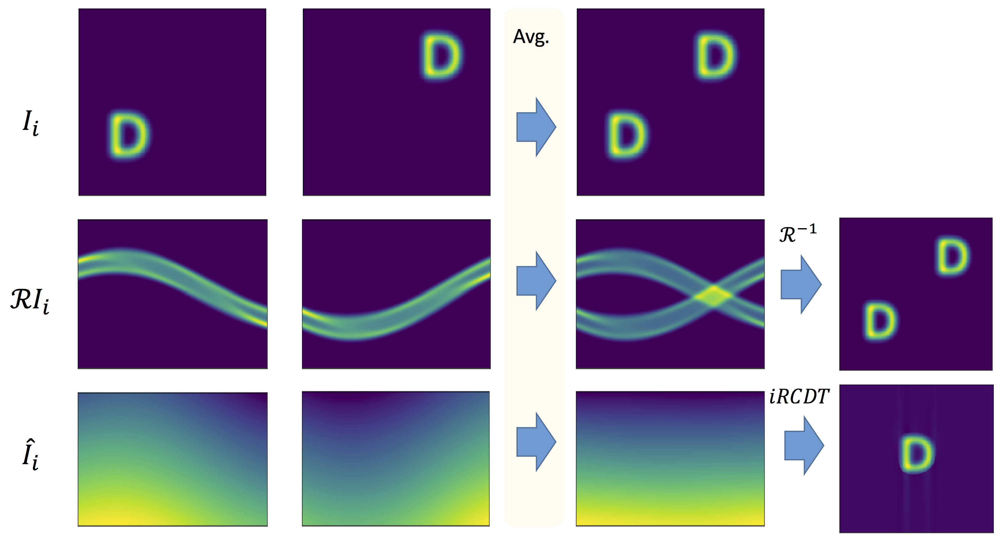
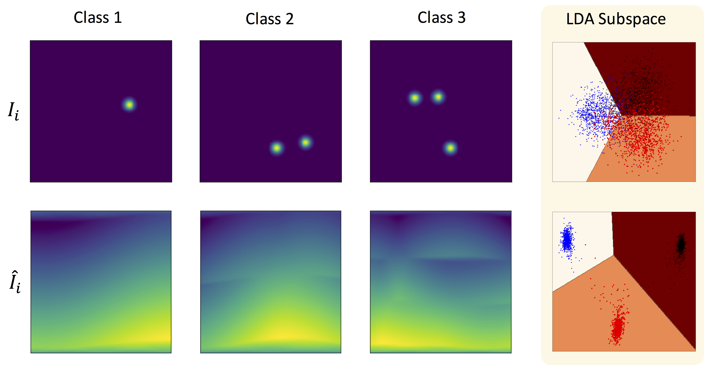

# Radon Cumulative Distribution Transform


Radon Cumulative distribution transform (Radon-CDT) as described in:

[(1) Kolouri S, Park SR, Rohde GK. The Radon cumulative distribution transform and its application to image classification. IEEE transactions on image processing. 2016 Feb;25(2):920-34.](http://ieeexplore.ieee.org/abstract/document/7358128/)

is a nonlinear and invertible transformation for non-negative d-dimensional signals that guarantees certain linear separation theorems. The transformation builds on top of the Cumulative Distributed Transformation (CDT) described in:

[(2) Park SR, Kolouri S, Kundu S, Rohde GK. The cumulative distribution transform and linear pattern classification. Applied and Computational Harmonic Analysis. 2017 Feb 22.](http://www.sciencedirect.com/science/article/pii/S1063520317300076)

and it extends CDT to d-dimensional probability distributions.  Similar to CDT, Radon-CDT also rises from the rich mathematical foundations of optimal mass transportation and combines it with integral geometry and Radon transform. Unlike the current data extensive nonlinear models, including deep neural networks and their variations, Radon-CDT provides a well-defined invertible nonlinear transformation that could be used alongside linear modeling techniques, including principal component analysis, linear discriminant analysis, and support vector machines (SVM), and does not require extensive training data.

 The corresponding iPython Notebook file for this post could be found [here](https://github.com/skolouri/Radon-Cumulative-Distribution-Transform/blob/master/Radon-CDT_Demo.ipynb). The demo is tested with:

1. numpy '1.13.1'
2. sklearn '0.18.1'
3. skimage '0.13.0'
3. scipy '0.19.1'

Here we first walk you through the formulation of CDT and Radon transform and then introduce the Radon-CDT and demonstrate its applications on various demos.

## Formulation


### Cumulative Distribution Transform (CDT)

Consider two nonnegative one-dimensional signals  and  defined on . Without the loss of generality assume that these signals are normalized so that they could be treated as probability density functions (PDFs). Considering  to be a pre-determined 'template'/'reference' PDF, and following the definition of the **optimal mass transportation**  for one-dimensional distributions, one can define the optimal transport map,  using,

<p align="center"></p>

which uniquely associates  to the given density .

###### Forward Transform:
We use this relationship to define the ** Cumulative Distribution Transform (CDT)** of  (denoted as ), with respect to the reference :

<p align="center"></p>

For one-dimensional PDFs the transport map  is uniquely defined, and can be calculated from:

<p align="center"></p>

where  and  are the corresponding cumulative distribution functions (CDFs) for  and , that is: , . For continuous positive PDFs  and ,  is a continuous and monotonically increasing function. If  is differentiable, we can rewrite the above equation as:

<p align="center"></p>

###### Inverse Transform

The Inverse-CDT of  is defined as:
<p align="center"></p>

where  refers to the inverse of  (i.e. ), and where . The equation above holds for points where  and  are differentiable. By the construction above,  will be differentiable except for points where  and  are discontinuous. Now we are ready to delve into some exciting applications of CDT.


### Radon Transform

The classic Radon transform, , maps a function   where  to the infinite set of its integrals over the hyperplanes of  and is defined as,
<p align="center"></p>

where  is the one-dimensional Dirac delta function.
For  where  is the unit sphere in , and . Note that  in other words the d-dimensional density  is projected into an infinite set of one-dimensional densities, . The figure below visualizes the Radon transform for a 2D Gaussian density.



Using the Slice Fourier theorem it can be easily shown that the Radon transform is invertible. The inverse of the Radon transform denoted by  is defined as:
<p align="center"></p>
where is a one-dimensional high-pass filter with corresponding Fourier transform  (it appears due to the change of coordinates from spherical to Cartesian in the Fourier Slice theorem) and  denotes convolution. The above definition of the inverse Radon transform is also known as the filtered back-projection method, which is extensively used in image reconstruction in the biomedical imaging community. Intuitively each one-dimensional projection/slice, , is first filtered via a high-pass filter and then smeared back into  along the integration hyperplanes, , to approximate . The summation of all smeared approximations then reconstruct . Finally, we note that Radon transform is a linear transformation.

### Radon-CDT

The idea behind Radon-CDT is to first slice a d-dimensional probability density  into a set of one-dimensional distributions and then apply CDT to the one dimensional distributions. Formally, given a template distribution  the Radon-CDT is defined as:

<p align="center"></p>

where  satisfies:

<p align="center"></p>

and the inverse transform is defined as:

<p align="center"></p>

where  can be calculated from  and  as  .

## Radon-CDT Demo

Throughout the experiments in this tutorial we assume that  is a uniform one-dimensional distribution. Lets start by showing the nonlinear nature of Radon-CDT.

### Nonlinearity

Let  and  be the following two images:

 

where the images are normalized (sum to one) to be considered as two-dimensional probability distributions. Let  denote the corresponding Radon-CDTs. We use the following code to calculate the Radon transform and the Radon-CDT of these images (i.e. distributions).

```python
import numpy as np
from skimage.io import imread
from skimage.transform import radon, iradon
from skimage.color import rgb2gray
import transportBasedTransforms.radonCDT as RCDT
#Get a Radon-CDT object
rcdt=RCDT.RadonCDT()
# Load images and calculate their Radon and Radon-CDT
I=[]
Ir=[]
Ihat=[]
for i in range(2):
    I.append(rgb2gray(imread('./Data/I%d.bmp'%(i))))
    Ir.append(radon(I[i]))
    Ihat.append(rcdt.transform(I[i]))
```
which results in,



Now to demonstrate the nonlinear nature of Radon-CDT, we choose the simplest linear operator, which is averaging the two distributions. We average the signals in the signal space, , in the Radon space , and in the Radon-CDT space, , and compare the results below.

```python
I3=np.asarray(I).mean(axis=0)
I4=iradon(np.asarray(rI).mean(axis=0))
I5=rcdt.itransform(np.asarray(Ihat).mean(axis=0)
```
which results in,



It can be clearly seen that Radon-CDT provides a nonlinear averaging for these signals.

### Linear separability

Park et al. (2) showed that CDT can turn certain not linearly separable classes of one-dimensional signals into linearly separable ones. Kolouri et al. (1) extended the CDT results to higher dimensional densities and showed that the same characteristics hold for Radon-CDT.

Here we run a toy example to demonstrate this characteristic. We start by defining three classes of two-dimensional images, where Class , for , consists of translated versions of a -modal Gaussian distribution. Here we generate these signal classes and their corresponding Radon-CDTs.

```python
N=1000
I=np.zeros((3,N,128,128))
K,L=rcdt.transform(I[0,0,:,:]).shape
Ihat=np.zeros((3,N,K,L))
for c in range(3):
    for i in range(N):
        for _ in range(c+1):
            x,y=np.random.uniform(30,98,(2,)).astype('int')        
            I[c,i,x,y]=1
        I[c,i,:,:]=I[c,i,:,:]/I[c,i,:,:].sum()
        I[c,i,:,:]=filters.gaussian_filter(I[c,i,:,:],sigma=3)    
        Ihat[c,i,:,:]=rcdt.transform(I[c,i,:,:])    
```

Next we run a simple linear classification on these signals in the original space and in the CDT space.

```python
from sklearn.discriminant_analysis import LinearDiscriminantAnalysis
lda=LinearDiscriminantAnalysis(n_components=2) #Get the classifier object
X=np.reshape(I,(3*N,128*128))
Xhat=np.reshape(Ihat,(3*N,K*L))
data=[X,Xhat]
label=np.concatenate((np.zeros(N,),np.ones(N,),-1*np.ones(N,))) # Define the labels as -1,0,1 for the three classes
dataLDA=[[],[]]
for i in range(2):
    dataLDA[i]=lda.fit_transform(data[i],label)
```

Below we visualize the two-dimensional discriminant subspace calculated by the linear discriminant analysis (LDA).



It can be clearly seen that while the classes are not linearly separable in the original space, the CDT representations of the signals is linearly separable.
